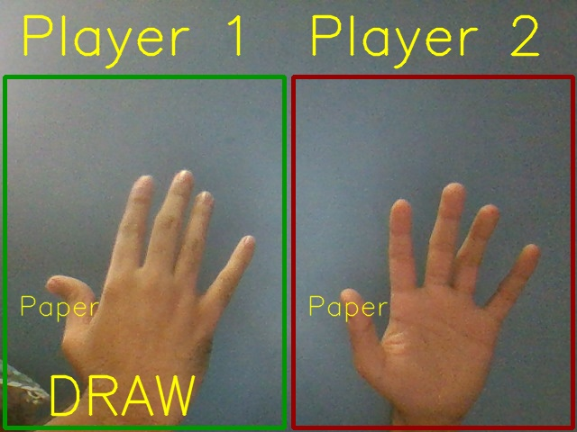
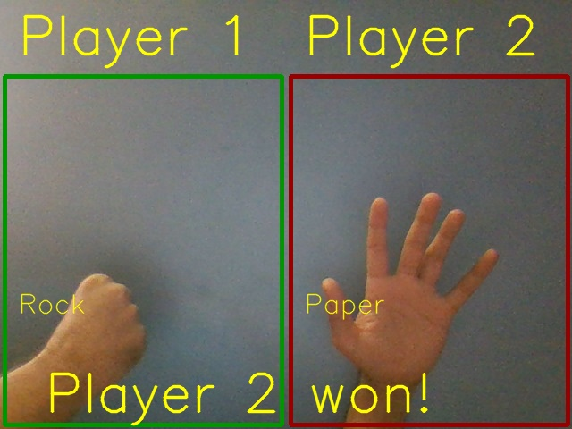

# Rock_Paper_Scissors_with_CNN
2 Player Rock Paper Scissors game where Computer guesses hand and gives the winner

## RPS_Model.py
Build a CNN and train it on dataset containing different Images of Rock, Paper and Scissors hand sign.
It then saves the model to model.JSON and weights to model.h5

## Main_Game.py
Each players places their hand in the designated box.
Press'ENTER' to start the 3 second Timer.

Show your hands in 3...2...1...0

Results looks like these:

### NOTE
1. The dataset is not included here. You have to seperately download it and place it like:
.\dataset\training_set for the training set which contains 3 folders named Rock, Paper, Scissor with respective images in it.
.\dataset\test_set for the test set which contains 3 folders named Rock, Paper, Scissor with respective images in it.
.\dataset\validation which contains images for predicting single image for validation purposes

2. Currently, the program works best with a white or clear background.

